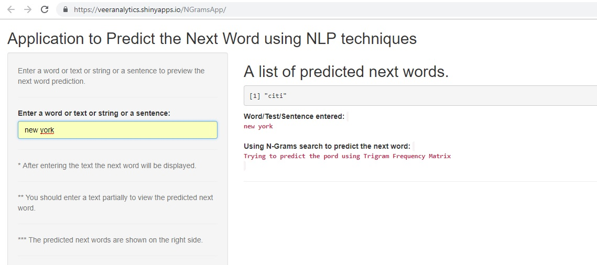

Predict The Next Word
========================================================
author: Veer Abhimanyu Singh
date: 05th January, 2019
autosize: true

Introduction
========================================================

The goal of this project is to display that we’ve gotten used to working with the data and that we are on track to create prediction algorithm. This project is about data understanding, data preparation, visualization and exploratory data analysis. Then build a predictive model to predict the next word.

- Used R to develop codes, then used shinyapps.io to deploy the application..
- ShinyApp: https://veeranalytics.shinyapps.io/NGramsApp/
- Milestone Report: http://rpubs.com/ascoolguy66/n-grams-nlp
- GitHub: https://github.com/veeranalytics/NGrams

Getting And Cleaning the Data
========================================================

The first step is getting and cleaning the data, which can be used to build models:

- A sample (1% from each) of the original data is taken from the three sources (blogs,twitter and news), which is then merged into one.
- The data cleaning is done by conversion to lowercase, strip white space, and removing punctuation and numbers.
- The following n-grams are created: Quadgram, Trigram and Bigram.
- the term-count tables are extracted from the N-Grams and sorted according to the frequency in descending order.
- The n-gram objects are saved as R-Compressed files (.RData files).

Word Prediction Model
========================================================
The prediction model for next word is based on the Katz Back-off algorithm. Explanation of the model is as below:

- Compressed data sets (ngrams-- .RData files) containing frequency in descending order are first loaded.
- User input words are cleaned in the similar way as before prior to prediction of the next word.
- For prediction of the next word, Quadgram is first used.
- If no Quadgram is found, back off to Trigram.
- If no Trigram is found, back off to Bigram.
- If no Bigram is found, back off to the most common word with highest frequency 'it' is returned.

Shiny Application
========================================================
A Snapshot of the shiny application:

